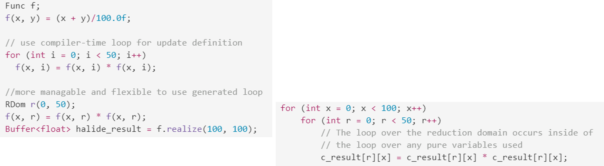

<<<<<<< HEAD
<!-- TOC -->

- [Advanced](#advanced)
- [Basics](#basics)
    - [Function Definition](#function-definition)
        - [Pure Function Definition](#pure-function-definition)
        - [Multi-pass function definition](#multi-pass-function-definition)
            - [Left Hand Side](#left-hand-side)
            - [Schedule update steps](#schedule-update-steps)
    - [Scheduling](#scheduling)
        - [Multi-stage pipeline](#multi-stage-pipeline)
            - [Default schedule](#default-schedule)
            - [`compute_root`](#compute_root)
            - [`compute_at`](#compute_at)
- [Func](#func)

<!-- /TOC -->

# Advanced

```c++
// Func.h
inline Expr min(FuncRef a, FuncRef b) {return min(Expr(std::move(a)), Expr(std::move(b)));}

// Halide::min defined in IROperator.h
inline Expr min(Expr a, Expr b) {
    user_assert(a.defined() && b.defined())
    << "min of undefined Expr\n";
    Internal::match_types(a, b);
    return Internal::Min::make(std::move(a), std::move(b));
}

// Halide::Internal::Min::make in IR.cpp
Expr Min::make(Expr a, Expr b) {
    internal_assert(a.defined()) << "Min of undefined\n";
    internal_assert(b.defined()) << "Min of undefined\n";
    internal_assert(a.type() == b.type()) << "Min of mismatched types\n";

    Min *node = new Min;
    node->type = a.type();
    node->a = std::move(a);
    node->b = std::move(b);
    return node;
}

// in IR.h
/** The lesser of two values. */
struct Min : public ExprNode<Min> {
    Expr a, b;

    static Expr make(Expr a, Expr b);

    static const IRNodeType _node_type = IRNodeType::Min;
};
```


# Basics

Concepts: realize over a domain

## Function Definition

### Pure Function Definition
Realize over shifted domain


```c++
// brighten image
brighter(x, y, c) = Halide::cast<uint8_t>(min(input(x, y, c) * 1.5f, 255));
Halide::Buffer<uint8_t> output =
        brighter.realize(input.width(), input.height(), input.channels());
```

### Multi-pass function definition

#### Left Hand Side

```c++
Func f;
f(x, y) = x * y;       // pure def

// The followings are update definition
f(x, 0) = f(x, 8);     // update def 0
f(0, y) = f(8, y) + 2; // update def 1

f(x, 17) = x + 8;
f(0, y) = y * 8;
f(x, x + 1) = x + 8;
f(y/2, y) = f(0, y) * 17;

for (int i = 0; i < 50; i++) 
   f(x, i) = f(x, i) * f(x, i);
// But it's more manageable and more flexible to put the loop
// in the generated code. We do this by defining a "reduction
// domain" and using it inside an update definition:
RDom r(0, 50);
f(x, r) = f(x, r) * f(x, r);
```


#### Schedule update steps

## Scheduling

// Scheduling is done with respect to Vars of a Func (not RVar?), and
// the Vars of a Func are shared across the pure and
// update steps.

Schedule - **`reorder(y,x)`**


### Multi-stage pipeline

#### Default schedule 
- If the producer has only pure def, inline it (no intermediate storage)


- If the producer has update steps, compute it in the innermost of their consumer


#### `compute_root`

[compute all of this function once ahead of time](http://halide-lang.org/docs/class_halide_1_1_func.html#a7f4db7e4884fe76399bf2a673567eab5)


#### `compute_at`


// 3) producer.store_root().compute_at(x), which allocates
// space for the consumer outside the loop over x, but fills
// it in as needed inside the loop.


Schedule a producer under a reduction domain variable of the consumer.


```

##### Wrapper based work-around
The consumer references the producer in multiple steps that do not share common variables. In this case neither `producer.compute_at(consumer, x)` nor `producer.compute_at(consumer, y)` will work, because either one fails to cover one of the uses of the producer. **Halide doesn't allow multiple different schedules for a single Func**. So we'd have to inline producer, or use producer.compute_root().

```c++
Func producer, consumer;
producer(x, y) = (x * y) / 10 + 8;

consumer(x, y) = x + y;
consumer(x, 0) = producer(x, x); 
consumer(0, y) = producer(y, 9-y);
```

Work-around


#### Out of bound

```c++
Buffer<uint8_t> input = load_image("images/rgb.png");

Expr clamped_x = clamp(x, 0, input.width()-1);
Expr clamped_y = clamp(y, 0, input.height()-1);
# Func
clamped(x, y, c) = input(clamped_x, clamped_y, c);
// Or use helper function from the BoundaryConditions namespace
clamped = BoundaryConditions::repeat_edge(input);

Func input_16("input_16");
input_16(x, y, c) = cast<uint16_t>(clamped(x, y, c));

Func blur_x("blur_x");
blur_x(x, y, c) = (input_16(x-1, y, c) +
                    2 * input_16(x, y, c) +
                    input_16(x+1, y, c)) / 4;

Func blur_y("blur_y");
blur_y(x, y, c) = (blur_x(x, y-1, c) +
                    2 * blur_x(x, y, c) +
                    blur_x(x, y+1, c)) / 4;

Func output("output");
output(x, y, c) = cast<uint8_t>(blur_y(x, y, c));

Buffer<uint8_t> result = output.realize(input.width(), input.height(), 3);

```
### Multi-pass functions in Multi-stage pipeline


## Reduction Domain

RVar: reduction variable represents a single dimension of a reduction domain (RDom). Don't construct them directly, instead construct an RDom. [see Halide API](http://halide-lang.org/docs/class_halide_1_1_r_var.html).



```c++
Func histogram("histogram");
histogram(x) = 0;
RDom r(0, input.width(), 0, input.height());
histogram( input(r.x, r.y) ) += 1;
Buffer<int> halide_result = histogram.realize(256);

for (int x = 0; x < 256; x++) 
    c_result[x] = 0;
for (int r_y = 0; r_y < input.height(); r_y++) 
    for (int r_x = 0; r_x < input.width(); r_x++) 
        c_result[input(r_x, r_y)] += 1;
```

# Function Definition

You can define a Func in multiple passes. [Halide tutorial code](http://halide-lang.org/docs/tutorial_2lesson_09_update_definitions_8cpp-example.html)
- *Pure* definition: the first, *pure* variables 
- *Update/Reduction* definitions: subsequent ones. 

Rules on variables in function definition:
- **Rule on LHS** 
  - Variables **within** () in reference to functions: used variable must first appear at its location in *pure* definition within the *same* function reference.
```c++
// legal updates
f(x  , x + 1) = x + 8;
f(y/2, y)     = f(0, y) * 17;

// Second argument to f on the left-hand-side must be 'y', not 'y + 1'.
f(y, y + 1) = y + 8;
// Arguments to f on the left-hand-side are in the wrong places.
f(y, x) = y - x;
```
- **Rule on RHS**
  - [**Recursive** reference](https://github.com/halide/Halide/issues/297): We imposed the rule that all **recursive** references to a Func on the **RHS** must contain the same **pure** vars in the same positions on LHS. This prevents all sorts of problems involving the _schedule changing the meaning_, by preventing all cross-talk between distinct values of the pure vars. That way it's safe to compute, recompute, cache, etc for any arbitrary domain of the pure vars.
> **Illegal** to have pure vars in LHS and RVar in RHS in the same dimension. That will make the result schedule dependent.

  * **Free** variable: (variables **outside** reference to functions): *free* variables on the right-hand-side must appear on the left-side
```c++
// OK
f(x, 3)   = f(x, 0) * f(x, 10);
f(0, y)   = f(0, y) / f(3, y);
f(y/2, y) = f(0, y) * 17;

// 1st argument to f on the right-hand-side must be 'x', not 'x + 1'.
f(x, 0)     = f(x + 1, 0);
// Free variables appear on the right-hand-side but not the left-hand-side.
f(3, 4) = x + y;
```

## Reduction

[Halide tutorial code](http://halide-lang.org/docs/tutorial_2lesson_13_tuples_8cpp-example.html)
>**Tuple reductions**: tuples are particularly useful in reductions. The simplest example is an argmax. Halide provides built-in reductions: argmax, argmin, sum, product, maximum, and minimum.

 Reductions are [higher order functions](https://hackernoon.com/higher-order-functions-what-are-they-be74111659e8): Functional programming?

 - [Fold or reduce (higher order function)](https://www.wikiwand.com/en/Fold_(higher-order_function))

 - [Map, filter & reduce in python](http://book.pythontips.com/en/latest/map_filter.html): [reduce in python](https://www.geeksforgeeks.org/reduce-in-python/)
   - `reduce`: two arguments in, one result out
   - 